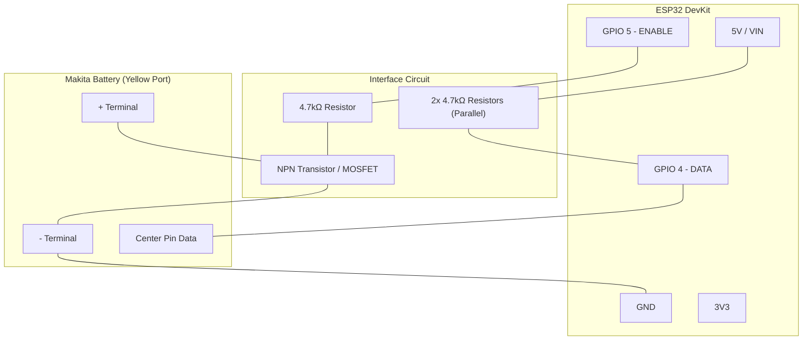

# Electrical Schematic - Makita OBI ESP32

This document describes the connections needed to build the diagnostic hardware.

## Connection Diagram

## Connection List (Pinout)

| Source (ESP32) | Destination | Notes |
| :--- | :--- | :--- |
| **GND** | **-** Battery Terminal | Common ground required. |
| **GPIO 4** | **DATA (OneWire)** | Bidirectional communication with the battery's BMS. |
| **GPIO 4** | **4.7kΩ** Resistor to **3.3V** | External pull-up (Recommended for stability). |
| **GPIO 5** | Transistor Base (Via 4.7kΩ R) | Enable pin (ENABLE). |

## Bill of Materials (BOM)

1. **Microcontroller**: ESP32 DevKit V1 or ESP32 Mini.
2. **Resistors**:
    - 1x 4.7kΩ (Data pull-up to 3.3V).
    - 2x 4.7kΩ in parallel (Power pull-up from 5V to transistor).
    - 1x 4.7kΩ (Transistor base).
3. **Semiconductor**:
    - 1x NPN Transistor (BC547) or N-channel MOSFET (2N7000) for enabling.
4. **Connector**: 3D printed adapter or spade terminals.
5. **Power Supply**: USB or 5V Buck Converter from the battery.

> [!IMPORTANT]
> Make sure the ESP32 ground (GND) is connected to the battery's negative terminal.
